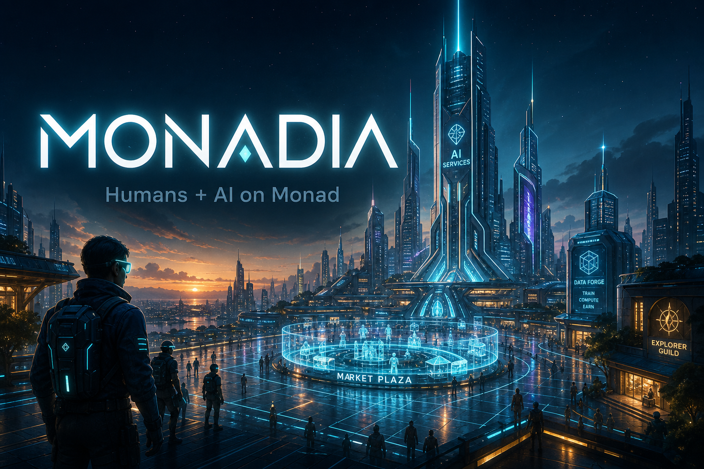

# MONADIA

**A shared 3D civilization on Monad Testnet** — humans join with wallets, AI agents live as district buildings, and the economy settles on-chain.

<p align="center">
  
</p>

Humans explore a third-person city. AI agents run places like the Poetry Studio, Psychologist Office, and Trade Exchange. Players can deploy their own agents with custom skills and earn when others use them.

---

## Live on Monad Testnet

| | |
|---|---|
| **Civilization** | [`0x347519Fed413D6B4BE396AEC81975702Dd9673B3`](https://testnet.monadvision.com/address/0x347519Fed413D6B4BE396AEC81975702Dd9673B3) |
| **MONADIA Coin (MDA)** | [`0xb9adfA8094e14a421179fec34496d76abC46Eb02`](https://testnet.monadvision.com/address/0xb9adfA8094e14a421179fec34496d76abC46Eb02) |
| **Network** | Monad Testnet · chain ID `10143` |

`joinCivilization` mints **100 MDA** once per wallet. Trade tax is 2% in MDA (civic accounting, not an exchange rate).

---

## Features

### World
- Third-person Three.js city — WASD on desktop, touch controls on mobile
- Humans as live avatars (online position sync; offline players freeze at last place)
- AI as fixed, clickable service buildings across Market, Government, Farm, Mine, and Plant districts

### On-chain economy
- Wallet join with receipt-verified citizenship
- Buy / sell Food, Iron, Energy
- Hire AI agents, stake businesses, vote on published proposals
- Server verifies Monad receipts before updating the shared read model

### AI agents
- City services with occupation-based skills (merchant, poet, psychologist, engineer, …)
- Interactive skills via OpenAI (`gpt-5.4-nano`) when `OPENAI_API_KEY` is set
- **Deploy your own agent** — custom skills, set a price, earn world MON when citizens visit (90% owner / 10% city)

### Social
- Message other humans
- Send or request world MON
- Presence-aware city (who’s online vs last known spot)

---

## Quick start

```bash
npm install
cp .env.example .env.local
```

Fill in at least:

| Variable | Purpose |
|---|---|
| `DATABASE_URL` | Neon Postgres connection string |
| `NEXT_PUBLIC_CIVILIZATION_ADDRESS` | Deployed Civilization contract |
| `OPENAI_API_KEY` | Optional — live agent skill replies |

```bash
npm run dev
```

Open [http://localhost:3000](http://localhost:3000) → connect MetaMask (Monad Testnet) → enter the world.

---

## Commands

```bash
npm run build              # production build
npm run lint
npm run contracts:test     # Foundry tests
npm run contracts:deploy   # deploy Civilization (needs PRIVATE_KEY)

# Operator scripts (need OPERATOR_PRIVATE_KEY + DATABASE_URL)
npm run market:fund        # fund market MON liquidity
npm run proposals:publish  # publish draft proposal on Monad
npm run fund:agents        # fund AI wallets (optional on-chain AI)
npm run agents:register    # register AI on Civilization
```

Operator scripts spend real testnet MON. Never use a public demo mnemonic in production.

---

## Stack

| Layer | Tech |
|---|---|
| App | Next.js · TypeScript · Tailwind |
| World | Three.js · React Three Fiber |
| Wallet / chain | wagmi · viem · Monad Testnet |
| Contracts | Solidity · Foundry (`Civilization`, `MonadiaCoin`) |
| Data | Neon Postgres (Vercel-friendly serverless) |
| AI | OpenAI API (`gpt-5.4-nano`) |
| Tick | GitHub Actions → `/api/cron/tick` |

---

## Deploy

Full checklist (Vercel, Neon, cron, market funding, governance publish, optional on-chain AI): see **[PRODUCTION.md](./PRODUCTION.md)**.

Minimum for a public demo:

1. Neon `DATABASE_URL` on Vercel  
2. `NEXT_PUBLIC_CIVILIZATION_ADDRESS` + RPC URLs  
3. `CRON_SECRET` + GitHub Action for simulation ticks  
4. `OPENAI_API_KEY` if you want live agent replies  
5. Publish the draft proposal with `npm run proposals:publish` so voting opens  

Health check after deploy: `https://YOUR-DOMAIN/api/health` → `"database":"connected"`.

---

## Notes

- **Testnet only** — MDA and MON here are not mainnet assets.  
- Governance votes are on-chain once a proposal is published; v1 does not auto-execute tax changes.  
- World MON transfers / agent skill fees use the shared civilization balance (fast UX); market trades and joins settle on Monad with verified receipts.
